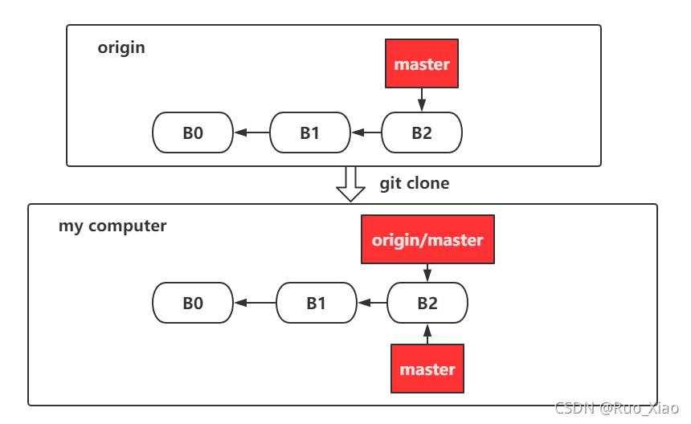

# Git_相关知识总结

## 1.  “git pull”、 “git fetch” 和 “git clone”的区别

+ **git clone** : 

  + 自动将远程主机命名为origin，拉取它的所有数据（复制到本地）。

  + 创建一个指向它的master分支的指针，并且在本地将其命名为**origin/master**。

  + 创建一个与origin的master分支在指向同一个地方的本地master分支。

    


待补充。。
（https://blog.csdn.net/itworld123/article/details/120220097）

  

## 2. 撤销上一步的操作


### 2.1 撤销“未被暂存的更改”

+ 假设”test1.txt" 之前已经被commit，直接更改它的内容之后，保存。现在需要放弃这个更改(返回上一次commit之后的状态)。

  ```bash
  git checkout test1.txt
  ```

  新版本(2.2later)git可以使用**restore**命令：

  ```bash
  git restore test1.txt
  ```

  如果某次commit之后，修改了若干文件，现在想全部放弃修改。

  ```bash
  git restore .
  ```

### 2.2 撤销“新增加的文件”

+ 假设在某次commit之后，新增加文件test2.txt（未被跟踪的状态）。现在需要撤销这个操作。

  - 可以先查看即将要删除掉的文件。然后再删除。

  	```bash
  	git clean -dn
  	```

  + 也可以直接删除。

    ```bash
    git clean -df
    ```
    
    

### 2.3 撤销“已被暂存（跟踪）的更改”

+ 假设”test3.txt" 之前已经被commit，直接更改它的内容之后，执行git add 命令（跟踪这个文件）。现在需要放弃更改（返回上一次commit之后的状态）.

  - 旧方法：依次执行两个命令。

  	```bash
  	git reset test3.txt
  	git checkout test3.txt
  	```

  - 新方法: 依次执行两个命令。

    ```bash
    git restore --staged test3.txt
    git checkout test4.txt
    ```
    
    

### 2.4 撤销上一次提交（commit）的文件

+ 某次提交（1）之后，新建一个文件test4.txt。再将这个文件test4.txt提交（2）。现在想将提交（2）撤销。

  - ”软性撤销“：撤销后，文件test4.txt依然在目录下, 文件的状态是刚被跟踪（add）的状态。git ls-files 命令也可以看到文件test4.txt。

  	```bash
  	git reset --soft HEAD~1
  	```

  - “撤销”：撤销后，文件test4.txt依然在文件下。文件的状态是还未被跟踪。git ls-files 命令看不到文件test4.txt 。

    ```bash
    git reset HEAD~1
    ```
	  
	- “硬性撤销” ： 撤销后，文件test4.txt被删除。

		```bash
		git reset --hard HEAD~1
		```


### 2.5 撤销已暂存的文件的状态

+ 执行完git add 命令后，文件test5.txt 被添加到暂存区。现在想把它移出暂存区。

  ```bash
  git reset HEAD test5.txt
  ```


### 2.6 修改上一次的提交

+ 某次提交之后，发现**忘记添加某些文件**，或者**写错了提交信息**，此时又不想产生额外的提交记录。

  ```bash
  git commit -m 'initial commit'
  ```

  此时，先将忘记添加的文件放入暂存区。然后 再次提交，--amend，弹出编辑器，此时编辑提交信息。

  ```bash
  git add forgotten_file
  git commit --amend 
  ```

  这时会弹出默认的git编辑器，可以修改上次提交的信息。或者直接在命令行中提交新的“信息”，覆盖上次的提交信息。

  ```bash
  git commit --amend -m 'add files'
  ```

  

  

  
